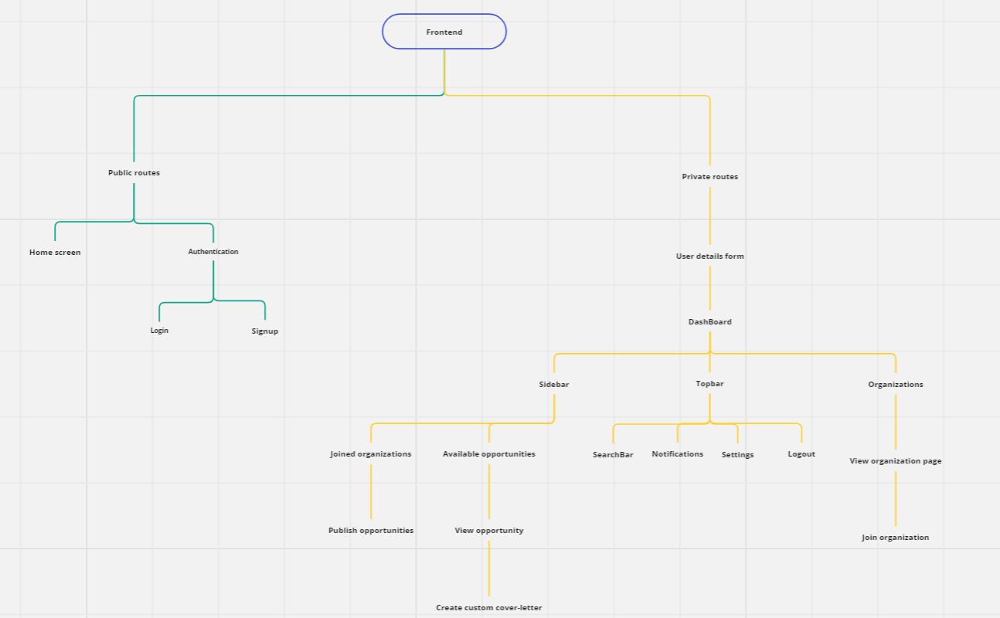

# Frontend (Next.js)

The frontend of OptySys is built using Next.js.

## Installation

To set up the frontend locally, follow these steps:

Install the necessary dependencies:

```shell
npm install
```

## Running the frontend

Create a file named `.env` under the frontend directory of the project and add the following environment variables:

```env
NEXT_PUBLIC_API_BASE_URL="http://localhost:8000/api/v1"
```

Start the development server:

```shell
npm run dev
```

Open your web browser and visit `http://localhost:3000` to access the OptySys frontend.

## Structure

- This is a high level design for the frontend.
- The design is configured in a hirerchical approach.
- Design is divided into two sub parts:-
    1. [Public Routes](#public-routes)
    2. [Private Routes](#private-routes)

### Public routes

- These routes are publicly accessible by any user.
- Public routes includes:-
  - Home Screen
  - Authentication
    - Login
    - Signup

### Private routes

- These routes are not publicly accessible only authenticated and authorized users can access.
- Authenticated users have to fill the user detail form, in order to further activate their account, which is strictly required for automating the process.
- Only activated users can access the dashboard.
- Private routes includes:-
  - User details form
    - DashBoard
      - Sidebar
        - Joined organizations
          - Publish opportunities
        - Available opportunities
          - View opportunities
            - Custom cover-letter
      - Topbar
        - Searchbar
        - Notifications
        - Settings
        - Logout
      - Organizations
        - View organization page
          - join organization


